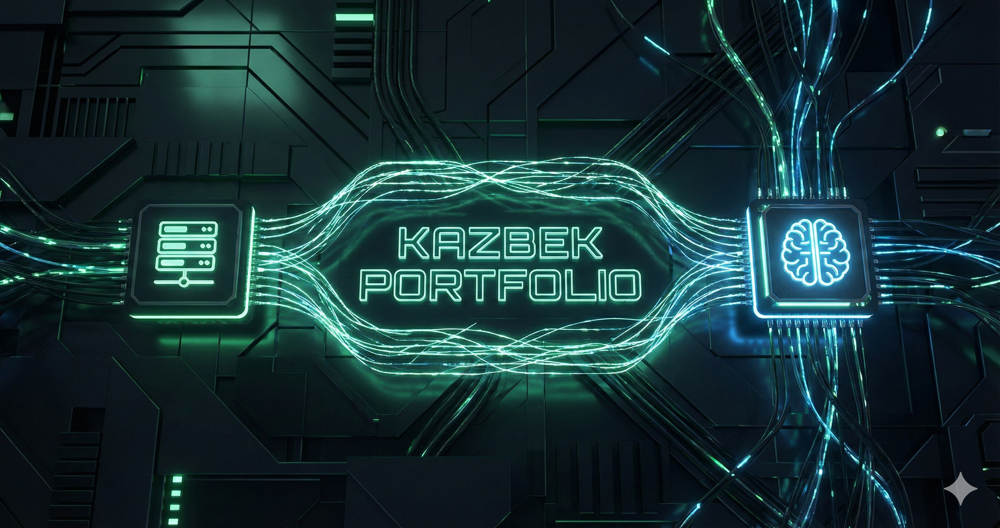

# Kazbek Portfolio

A personal developer portfolio for Kazbek Assanbek, presenting selected projects, technical experience, education, and contact information in a responsive interface.

## Preview



## Features

- Responsive landing, projects, about, contact, and custom 404 pages
- Animated page elements and an interactive spotlight background
- Project gallery with screenshots, technology tags, and live links where available
- Contact form that forwards enquiries to Telegram through a server-side API route
- Search-friendly metadata, Open Graph image, JSON-LD profile data, sitemap, and robots configuration

## Tech Stack

- Next.js 16 with the App Router
- React 19 and TypeScript
- Tailwind CSS
- Framer Motion
- Radix UI primitives and Lucide icons
- Telegram Bot API for contact form delivery

## Getting Started

```bash
git clone https://github.com/RealKazbek/portfolio.git
cd portfolio
npm install
cp .env.example .env.local
npm run dev
```

Open [http://localhost:3000](http://localhost:3000) in your browser.

The contact form requires `TELEGRAM_BOT_TOKEN` and `TELEGRAM_CHAT_ID`. The rest of the portfolio can be viewed locally without configuring them.

Useful checks:

```bash
npm run lint
npm run typecheck
npm run build
```

## Project Structure

```text
app/          Pages, metadata routes, styles, and the contact API route
components/   Navigation, visual effects, and reusable UI components
lib/          Shared utilities
public/       Favicons, social preview, and project images
```

## Deployment

The application can be deployed on [Vercel](https://vercel.com/) by importing the GitHub repository. Add `TELEGRAM_BOT_TOKEN` and `TELEGRAM_CHAT_ID` to the project environment variables before deploying so the contact form can deliver messages.

## Author

Kazbek<br>
GitHub: [RealKazbek](https://github.com/RealKazbek)
