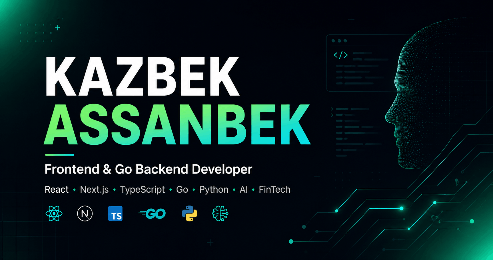

# Kazbek Portfolio

A personal developer portfolio for Kazbek Assanbek, a fourth-year IITU Computer Engineering student focused on frontend development and growing into Go backend development. It presents selected projects, technical experience, education, and contact information in a responsive interface.

## Preview



## Features

- Responsive landing, projects, about, contact, and custom 404 pages
- Animated page elements and an interactive spotlight background
- Project gallery with screenshots, technology tags, and live links where available
- Contact form that forwards enquiries to Telegram through a server-side API route
- Search-friendly metadata, Open Graph image, JSON-LD profile data, sitemap, and robots configuration

## Tech Stack

- Next.js 16 with the App Router
- React 19 and TypeScript
- Tailwind CSS
- Framer Motion
- Radix UI primitives and Lucide icons
- Telegram Bot API for contact form delivery

## Getting Started

```bash
git clone https://github.com/RealKazbek/portfolio.git
cd portfolio
npm install
cp .env.example .env.local
npm run dev
```

Open [http://localhost:3000](http://localhost:3000) in your browser.

The contact form requires `TELEGRAM_BOT_TOKEN` and `TELEGRAM_CHAT_ID`. `SITE_URL` controls canonical, Open Graph, sitemap, and robots URLs. The rest of the portfolio can be viewed locally with the example defaults.

Useful checks:

```bash
npm run lint
npm run typecheck
npm run build
```

## Project Structure

```text
app/          Pages, metadata routes, styles, and the contact API route
components/   Navigation, visual effects, and reusable UI components
lib/          Shared utilities
public/       Favicons, social preview, and project images
```

## Self-Hosting

The production server listens on port `3000`. Set the variables from `.env.example`, using the final HTTPS origin for `SITE_URL`. Because Next.js pre-renders public metadata, `SITE_URL` must be available during the build as well as at runtime.

### Node.js

```bash
npm ci
set -a
source .env.production
set +a
npm run build
NODE_ENV=production PORT=3000 npm start
```

Use a process supervisor such as systemd to keep the server running and restart it after failures or host reboots.

### Docker

```bash
docker build --build-arg SITE_URL="$SITE_URL" -t kazbek-portfolio .
docker run --detach \
  --name kazbek-portfolio \
  --env-file .env.production \
  --publish 127.0.0.1:3000:3000 \
  --restart unless-stopped \
  kazbek-portfolio
```

Binding to `127.0.0.1` keeps the application private behind the reverse proxy.

### Nginx reverse proxy

Terminate HTTPS at Nginx and proxy requests to the internal Next.js server:

```nginx
server {
    listen 80;
    server_name _;

    location / {
        proxy_pass http://127.0.0.1:3000;
        proxy_http_version 1.1;
        proxy_set_header Host $host;
        proxy_set_header X-Real-IP $remote_addr;
        proxy_set_header X-Forwarded-For $proxy_add_x_forwarded_for;
        proxy_set_header X-Forwarded-Proto $scheme;
        proxy_set_header Upgrade $http_upgrade;
        proxy_set_header Connection "upgrade";
    }
}
```

Replace the catch-all `server_name`, configure TLS certificates, and set `SITE_URL` to the resulting public HTTPS origin before production use.

## Author

Kazbek<br>
GitHub: [RealKazbek](https://github.com/RealKazbek)
